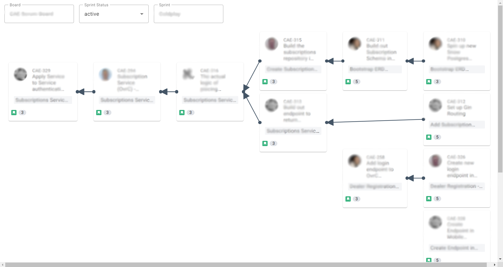

# Jira Story Dependency Map

A graphical representation of Jira story interdependencies.


## Running with Docker

1. Install and run [Docker](https://docs.docker.com/get-docker/)
2. To quickly start the image you can do two things:

   1. Run the following command from your terminal:
      ```docker
      docker run -e USERNAME={{USERNAME}} \
      -e PASSWORD={{PASSWORD}} \
      -e JIRA_URL={{URL}} \
      -p 80:80 \
      --name jira-story-dependency-mapping \
      cbekmezian/jira-story-dependency-map:latest
      ```
      Then navigate to http://localhost
   2. Create a .env file in the root of this project and set the JIRA_URL, and USERNAME/PASSWORD or ACCESS_TOKEN environment variables. Navigate to the root of this project in your terminal and run

      `docker-compose up jira_dependencies -p 80:80`

## Environment Variables

### `JIRA_URL`

The url to your Jira Server. It should look something like: https://jira.mydomain.com

---

### `USERNAME`

Your Jira account username. This only needs to be provided if you are not providing the ACCESS_TOKEN environment variable.

---

### `PASSWORD`

Your Jira account password. This only needs to be provided if you are not providing the ACCESS_TOKEN environment variable.

---

### `ACCESS_TOKEN`

A Jira personal access token (PAT). This is the preferred authorization method. If the USERNAME and PASSWORD environment variables are provided instead, they are used to create a PAT, which is used for all future requests. The easiest way to create a PAT is via the following CURL request:

`curl -X POST {{JIRA_URL}}/rest/pat/latest/tokens -H "Content-Type: application/json" -d '{"name": "jira-dependency-mapping"}' --user "USERNAME:PASSWORD"
`
You can read more about this method of creating PATs here:
[https://confluence.atlassian.com/enterprise/using-personal-access-tokens-1026032365.html#UsingPersonalAccessTokens-CreatingPATsusingRESTAPI](https://confluence.atlassian.com/enterprise/using-personal-access-tokens-1026032365.html#UsingPersonalAccessTokens-CreatingPATsusingRESTAPI)

---

### `DISABLE_CORS`

Defaults to true, will not allow CORS.

## Building

`docker build -t cbekmezian/jira-story-dependency-map:latest .`

## Publishing

`docker push cbekmezian/jira-story-dependency-map:latest`
